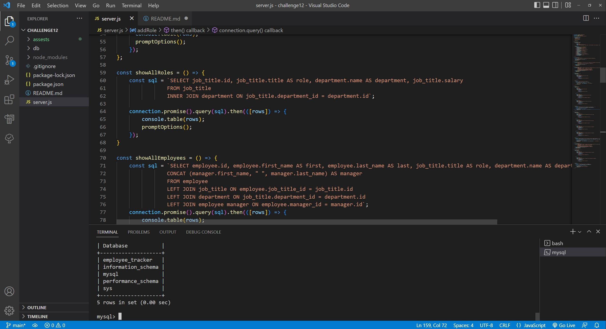
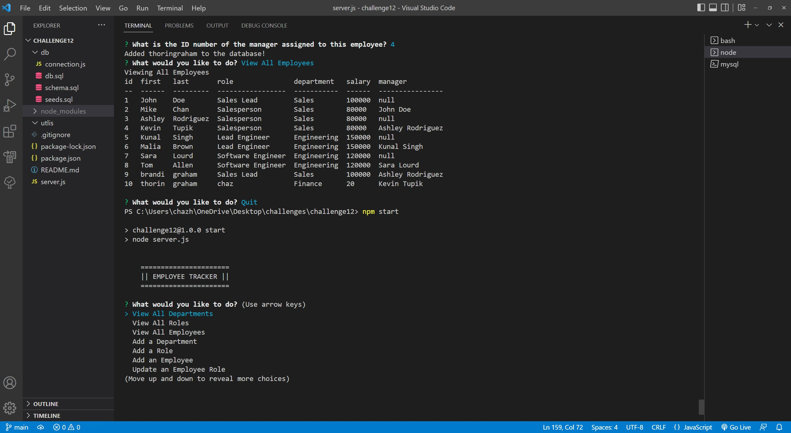

# Chazs Employee Tracker

## Descripton
A back-end application that uses npm express, npm inquirer, mysql12, and cTable to gather information that views databases and adds information to databases as well via user input.
hyper link here

## Table of Contents
  * [Installation Instructions](#installation-instructions)
  * [Application Usage](#application-usage)
  * [Contributors](#contributors)
  * [Licenses](#licenses)
  * [Tests](#tests)
  * [Contact Me](#contact-me)

## Installation Instructions
Before running this application you must install npm i inquirer@8.2.4, npm i express, mysql12, npm install console.table --save.

## Application Usage
-The usage is to keep track of an employers employees through the use of databases.

## Contributors
By Chaz Graham

## Licenses
This application is licensed under: None

## Tests
To test application open the console and run the following comand: none

## Contact Me
If you have additional questions you can contact me at https://github.com/chazgraham